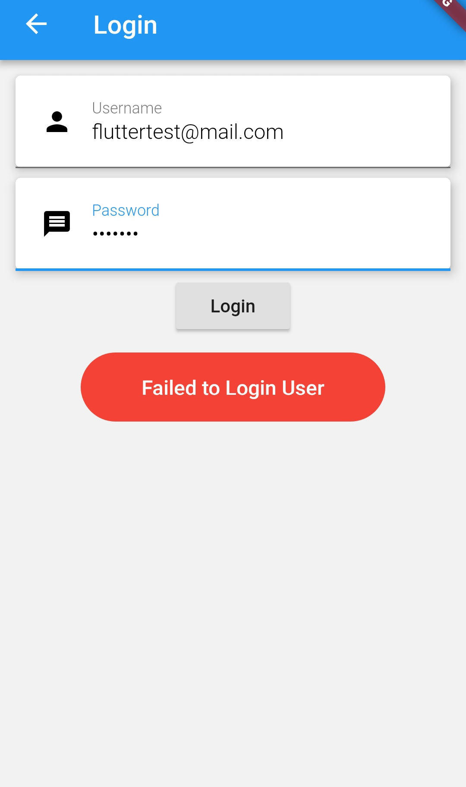

# flutter_loginSignup-phpMyAdmin

Flutter login and Signup example using phpMyAdmin.

## Source Code Includes:

  * [x] API(written in php)
  * [x] Database File
  * [x] Screenshots
  * [x] Fully working login and Signup code in dart
  * [x] Toast
  * [x] Materiall design of TextField
  

       

## Installation note:
Just paste the code in your PC and paste the API in your desire folder and finally import the DATABASE. 
Then run command flutter run , the project will run perfectly

### Created & Maintained By

[Bhuwan Ojha](https://github.com/bhu1oja)  ([Youtube](https://www.youtube.com/channel/UCa-XTJKKDSVkCaoZAUx3g4g))
([Facebook community](https://www.facebook.com/groups/380421285857980/?source_id=377578722996429))